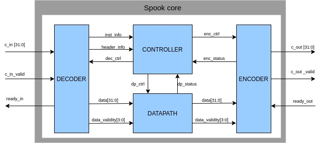

# **Spook Hardware Implementations**

This repository contains all the files relative to the protected HW implementations of [Spook](https://www.spook.dev/) used for 
the Hardware-oriented version of Capture the Flag. A practical implementation was done on 
a [Sakura-G board](http://satoh.cs.uec.ac.jp/SAKURA/hardware/SAKURA-G.html) which was used to generate the
datasets (currently available on the [Spook website](https://www.spook.dev/)).

The hardware core follows a custom API broadly based
on the [LWC HW API](https://cryptography.gmu.edu/athena/LWC/LWC_HW_API.pdf), proposed in the context of the 
LWC NIST competition. We provide a python library that generates from a high level the data that 
should be sent to the core in order to perform different operations (e.g., load the key, encryption, ...).
The latter is used to generate the test vectors used in simulatations as well as the actual FPGA implementation. 

_Note: no security claims comes with this code. It is a straightfoward implementation of state-of-the-art hardware masking scheme which security depends on various factors such masking order, independence 
assumption and noise level._

## Organisation

The repository contains the following directories:

+ [spook_msk](spook_msk): protected implementation.
    - [hdl](spook_msk/hdl): HDL files of the implementation.
    - [schematics](spook_msk/schematics): useful schematics of the architecure.
    - [simu](spook_msk/simu): script and workspace for the simulations.
    - [tb](spook_msk/tb): directory containing HW testbenches. 
+ [spook_hw_api](spook_hw_api): scripts to format data according to the HW API (see below)

## Software dependencies

### Simulations

In order to run the simulations, the following tools must be installed beforehand:

+ `Icarus Verilog` <http://iverilog.icarus.com/>

The main scripting programming languages for this repository are Python3 (tested under `python3.6`)
and linux shell. The following [PyPi](https://pypi.or) packages are required:

* `numpy`

## Spook HW API overview

### Data Formatting

To perform an operation (e.g., encryption or decryption), data are sent to and received from the core according to 
a specific communication protocol based on sequences of 32-bit words (denoted next commands). A command
is considered as a 32-bit vector, for which each bits is denoted bi (b0 being the
less significant bit), as shown here:  

| b31 | b30 | b29 | ... | b1 | b0 |
|----------------|----------------|----------------|-----|---------------|---------------| 

Following that, the notation *c*[*y*:*x*] represents the set of bits of the command *c*, starting from
b*x* to b*y* included. The commands have 
different meanings depending on their types. More especially, the different types are:

**Instruction/Status**

The instruction is the first command of an operation. The 4 Most Significant Bits (MSBs) of each instruction are denoted the 
`opcode` and indicates the operation to perform. The other bits are unused and are considered to be set at 0. 
An instruction is thus structured as follows:

| `opcode`=[b31:b28] | 0*| 
|----------------------------------------|---|

where the `opcode` takes the following values:

+ `4'b0010` *(ENC)*: to perform an encryption.
+ `4'b0011` *(DEC)*: to perform a decryption.
+ `4'b0100` *(LDKEY)*: to load a fresh key.
+ `4'b1010` *(LD_SEED)*: to load a fresh seed into a PRNG.

Each instruction ending is acknowledged using a status command from the core. On one hand, an instruction
proceeding as expected results in a success status. On the other hand, 
when an error occurs (e.g, the core is receiving data that he was not expecting), the
instruction under process results in a failure status. Status command
are structured similarly to instruction, except that the `opcode` is only taking the 
following values:

+ `4'b1110` *(SUCCESS)*: the instruction was processed properly.
+ `4'b1111` *(FAILURE)*: the instruction encountered something unexpected.

Last but not least, the failure status is also used when the tag provided during a decryption process 
is not valid.

**Header**

A dedicated sequence of commands (denoted as segments) are used to send data. A segment
begins with a specific command (i.e., the header) containing all the information ensuring a proper
data transfer. The 4 MSBs of each header (denoted `dtype`) indicates the type of data 
contained in the current segment. These can take the following values:

+ `4'b1100` *(KEY)*: the secret key.
+ `4'b1101` *(Npub)*: the public nonce. 
+ `4'b0001` *(AD)*: the associated data.
+ `4'b0101` *(CT)*: the ciphertext.
+ `4'b0100` *(PT)*: the plaintext.
+ `4'b1000` *(TAG)*: the tag.
+ `4'b1001` *(SEED)*: a PRNG seed (protected implementation only).

In addition, the next information related to the current segment are also embedded:

+ `eot` *(End-Of-Type)*: indicates that the segment is the last with the current `dtype`
+ `eoi` *(End-Of-Inputs)*: indicates that the current segment is the last to contain inputs other than the tag. 
+ `last` *(Last)*: indicates that the current segment is the last of the current instruction under process.
+ `seln` *(Selection Nibble)*: a nibble used to select the PRNG that is seeded (protected implementation only).
+ `length` *(Data length)*: the size (in term of bytes) of the data contained in the segment.

The usage of `eot`, `eoi`and `last` follow the [LWC HW API](https://cryptography.gmu.edu/athena/LWC/LWC_HW_API.pdf).
Putting all together, the following header structure is considered:

|`dtype`=[b31:b28]|0|`eot`=b26|`eoi`=b25|`last`=b24|`seln`=[b23:b20]|0|0|0|1|`length`=[b15:b0]|
|---------------------------------------|-|--------------------|--------------------|---------------------|--------------------------------------|-|-|-|-|---------------------------------------|

**Raw data**

This is the basic command type, representing the raw data sent to the core. In this case, the 32 bits in the vector
represent data bits.<!--, the latter being encoded as a sequence of 32-bit words.-->

### Commands Flows

Raw data are sent in segments. A segment is the concatenation of a header and some raw data commands.
A segment is said to be filled when the amount of data bytes he contains is a multiple of 4. In other
case, the segment is said to be unfilled. Data related to a same `dtype` can be splitted in multiple 
segments as long as these are sent sequentially and that the only unfilled segment is the last one.
Next examples show valid commands streams for the same associated data vector. 
The notation B*i* refers to the byte of index *i*, B0 being the less significant byte:

Associated Data (big endian ordering, 11 bytes long):

|B10|B9|B8|...|B2|B1|B0|
|--------------|-------------|-------------|---|-------------|-------------|-------------|

| **Stream A** | **Stream B** | **Stream B**| 
|:--------------:|:--------------:|:-------------:|
|head0(`dtype`=AD, `eot`=1, `length`=11)|head0(`dtype`=AD, `eot`=0, `length`=8)|head0(`dtype`=AD, `eot`=0, `length`=4)|
|[B3,B2,B1,B0]|[B3,B2,B1,B0]|[B3,B2,B1,B0]|
|[B7,B6,B5,B4]|[B7,B6,B5,B4]|head1(`dtype`=AD, `eot`=0, `length`=4)|
|[X,B10,B9,B8]|head1(`dtype`=AD, `eot`=1, `length`=3)|[B7,B6,B5,B4]|
| |[X,B10,B9,B8]| head1(`dtype`=AD, `eot`=1, `length`=3)|
| | |[X,B10,B9,B8]|

A typical instruction command flow is composed of one instruction followed by one or muliple data segments.
Data are expected to be sent in a specific order depending on the instruction processed. The next Table
show the expected command flow for each instruction. The notation DS`dtype` denotes here the data segment 
related to the data type `dtype` and the notation INST`opcode` denote the instruction related to `opcode`:

|**Encryption**|**Decryption**|**Load new key**|**Load new seed**|
|:-------:|:-------:|:---------:|:-----------:|
|INSTENC|INSTDEC|INSTLDKEY|INSTLD_SEED|
|DSNpub|DSNpub|DSKEY|DSSEED|
|DSAD|DSAD| | |
|DSPT|DSCT| | |
| |DSTAG| | |
| | | | |

Each instruction ends by outputting a status that is preceeded by data segment when needed (e.g., CT and TAG for an encryption).
The expected outputted commands flows for each instruction are shown in the next Table:

|**Encryption**|**Valid decryption**|**Load new key**|**Load new seed**|
|:-------:|:-------:|:---------:|:-----------:|
|DSCT|DSPT|INSTSUCCESS|INSTSUCCESS|
|DSTAG|INSTSUCCESS| | |
|INSTSUCCESS| | | |

## Spook Global Hardware Framework
 
In this section the global framework used for the design process of Spook HW cores (for both flavours) is presented.
 
 

 

The Spook HW core is interfaced with two AXI4-Stream interfaces (one at the input and one at the output). 
Signals `c_in` and `c_out` are respectively command buses entering to and outgoing from the core. 
Signals `c_in_valid` and `c_out_valid` indicate that the corresponding commands are valid, while 
signals `ready_in` and `ready_out` indicate that the command receivers are ready to proceed their 
respective commands. A valid data tranfer is performed and aknowledged when both the `*_valid` and the
`ready_*` signals are high during a clock cycle. The core is composed by the following 4 main blocks:

+ **Controller**: This module is the practical mind of the core. Based on a Finete State Machine (FSM), it controls the 
other blocks of the design in order to properly perform the Spook algorithm based on the API. The bus `*_ctrl` 
represent controls signals going to a core while `*_status` bus represent some status flags coming back to the controller. 
+ **Decoder**: This module is the practical input of the core. It receives and decodes the commands, keeping the 
information related to the current instruction and header under process (respectively `inst_info` and `header_info`). 
It also computes the `data_validity` of each raw data command which is simply a validity flag for each byte of the command.
+ **Datapath**: This module contains all the circuitry related to the computation required to perform a call of Spook. 
More particularly, it is composed by raw data holders (e.g., for the long term key), routing 
logic (i.e., muxes) and the logic for the primitives Shadow and Clyde.  
+ **Encoder**: As opposed to the decoder, this module is the practical output of the core. 
It receives digested data from the datapath module. It also encodes digested data according to the API before forwarding them out. 

## Spook Protected Architecture

The architecture of the datapath for the protected Spook HW core is here presented in detail. The main difference with 
the unprotected case is that the Clyde primitive is designed implementing countermeasures against Side-Channel-Attacks (SCAs). This implementation makes use of masking with [Cassiers et al.](https://eprint.iacr.org/2020/185) scheme. 
Additionally, the long term key is stored as a sharing instead of raw data. 
Last but not least, the tag verification process is performed using the inverse operation of Clyde. 

### Quick Overview

Since Shadow does not need to be protected, both primitives are implemented as independent modules. On top of these, 
some routing circuitry (i.e., muxes) redirects data in a proper manner. As for the unprotected case, the 
primitives process data serially on reduced parts of the state in order to reduce the logical cost.
Precisely, modules for Shadow's Round A and Round B, each computing over 128-bit parts of the state, are processed 
sequentially (i.e., 4 cycles for RA then 4 cycles for RB). Additionally, the Clyde core is implemented with independent
Sbox layer and Lbox layer (typically 8 Sboxes and 1 Lbox), both being also processed sequentially to perform a round function. 
Finally, the inverse Sbox is implemented using the direct Sbox logic with two additional linear 
layers. This allows to significantly reduce the implementation cost comparing to the naive design strategy.

While the provided core implements the architecture described above, it offers the possibility to set 
the amount of parallel Sboxes and Lboxes in the masked Clyde core. The amount of share is also editable. 
This is done by modifying the following generation parameters in 
the [datapath](/SpookMasked/hdl/mode_hdl/datapath.v) file:
+ `d`: the amount of share used. 
+ `PDSBOX`: more info related to this parameter in the [MSKclyde_128_1R](/SpookMasked/hdl/clyde_MSK_SB3c/MSKclyde_128_1R.v) file.
+ `PDLBOX`: more info related to this parameter in the [MSKclyde_128_1R](/SpookMasked/hdl/clyde_MSK_SB3c/MSKclyde_128_1R.v) file.

### Protected Clyde core
The protected version of Clyde is implemented using the masking countermeasure. The masking scheme considered
is the glitch-resistant variation of Ishai et al.'s private circuits proposed by [Cassiers et al](https://eprint.iacr.org/2020/185).
Next, the amount of shares used for the masking scheme is denoted by `d`.
As shown next, the Clyde module is separated in two mechanisms: the Clyde computation itself and the 
generation/handling of the randomness. The computation takes as input the sharing of the key (i.e., the `sharing_key` bus), the 
tweak (i.e., the `tweak` bus) and either the plaintext or the ciphertext (i.e., the `data_in` bus). The control signal `inverse` is used to 
specify to the core which operation (i.e., encryption or decryption) is currently perfomed. Next, control signals will be represented in blue.  

The randomness is generated by using two (similar) instances of a maximum length
[128-bits LFSR](https://www.xilinx.com/support/documentation/application_notes/xapp210.pdf) (i.e., the `prng_unit` module). Seeds can be
sent to these instances through the `feed_data` signal by means of a `SEED` segment, as explained above. 
A specific controller (i.e., the `stalling_unit`) is used to properly handle the interaction between the PRNGs and the Clyde logic (using the 
`control_sig*`, `control_status*`and `stall_control*` signals). Basically, the latter enables the LFSRs and stalls the computation 
core when randomness is required and not ready. It is also used as a control wrapper interface for the Clyde computation logic. Note 
that in the case of the CTF, the randomness is generated in 1 clock cycle and the computation core is thus not stalled. 

 

Going deeper, the architecture of the practical Clyde's logic is described and shown next. First of all, non-sensitive data are
formatted as a valid sharing (using an instance of the module `cst_mask`). This operation boils down to a proper formatting of the data. 
Another way to see it is to compare it to a sharing operation of each bits of the data with a constant randomness of 0. A sharing data 
representation is next represented in green. Although this operation is not visible for the tweak on the schematic, it is also 
implicitly present in the `MSKaddWTK` module developed next. 

An execution of Clyde128 starts with a tweakey addition, as well as a 
constant addition in the case of a decryption. These are performed by the `MSKaddWTK` module. The latter takes as input the key sharing,
the appropriate $`\delta`$ value use to compute the tweakey (denoted `delta_TWK`), the constant W (denoted 'W') and offers the 
possibility to perform each addition independently. The signals `delta_TWK` and `W` come from specific modules (respectively 
`phi_unit_dual` and `Wsel_lfsr_dual`) that compute the corresponding public constants. 

Once the initial addition is done, the Clyde's Rounds are computed by successively performing 
sbox-layer or lbox-layer (the order depends on the operation under process) and constant/tweakey addition when needed. The constants 
and the tweakeys values are derived by specific modules. As explained next, both the computation of the lbox layer and the sbox layer can be serialized 
up to some point.

 

### Lbox Layer

The first layer presented is the Lbox layer. The latter is in fact composed of parallel `MSKlbox_dual` module 
instances (inside the `MSKlbox_unit_dual` module). Each of these instances either computes the direct or 
the inverse Lbox operation depending on the `inverse` control signal. A full Lbox layer is performed following 
a shift register approach by looping over the `MSKlbox_unit_dual` module each time with a different part of the shared state. 

 

A `MSKlbox_dual` instance is practically implemented using dedicated logic for the lbox and its inverse operation. The 
`inverse` signal is used to control a mux at the output of the core, selecting the desired output value.  The amount 
of parallel `MSKlbox_dual` instances can be either 1 or 2 and can be chosen with the parameter `PDLBOX` (for Power Divider LBOX). 
The latter directly impacts the bus sizes `SIZE_REM_LB` and `SIZE_CHUNK_LB` as well as the computation latency required.
The different configuration are summed up in the following table:

|**`PDLBOX`**|**Amount of `MSKlbox_dual` instances**|**`SIZE_REM_LB` (in bits)**|**`SIZE_CHUNK_LB` (in bits)**|**Latency (in clock cycles)**|
|:-----:|:-----:|:-----:|:-----:|:-----:|
| 0 | 2 | 0 | 128*d | 1 |
| 1 | 1 | 64*d | 64*d | 2 |

### Sbox Layer 

Similarly to the Lbox layer, the Sbox layer is composed of parallel `MSKspook_sbox_dual` module instances
(inside of the `MSKsbox_unit_dual` module). Each of these instances can either computes the direct of the 
inverse sbox operation depending on the `inverse` control signal. A full Sbox layer is performed following
a shift register approach by looping over the `MSKsbox_unit_dual` module each time with a different part if the shared state. 
In comparison with the lbox layer, some data representation transformation are applied at the IOs of the logic. The 
latter are intended to move from a bundle representation to a columns representation (the `MSKbundle2cols` module) or 
inversely (the `MSKcols2bundle` module). These only consist in wiring modification. 

 

A`MSKspook_sbox_dual` instance is mainly composed by the logic dedicated to perform the Sbox operation
(i.e., `MSKspook_spook`). The inverse Sbox operation is performed by reusing the Sbox logic with two 
additional linear layers (`MSKpre_inv_sbox` before the sbox logic and `MSKpost_inv_sbox` after). In 
particular, the input of the Sbox logic comes either from `MSKpre_inv_sbox` or from the instance 
input depending on the value of the `inverse` control signal. Similarly, the output of the instance 
comes either from `MSKpost_inv_sbox` or from the output of the sbox.

 

The amount of parallel `MSKspook_sbox_dual` instances lies in [1,2,4,8,16,32] and can be chosen with the 
parameter `PDSBOX` (for Power Divider SBOX). The latter directly impacts on the bus size of `SIZE_REM_SB` and `SIZE_CHUNK_SB`, as 
well as the computation latency required. Finally, because of the specific architecture of the protected AND gates, 
the Sbox logic is implemented as a 3-levels pipeline. The induced latency is thus taken into account, requiring an offset of 3 clock cycles, as shown above. 
The different configurations are summed up in the following table:

|**`PDSBOX`**|**Amount of `MSKspook_sbox_dual` instances**|**`SIZE_REM_SB` (in bits)**|**`SIZE_CHUNK_SB` (in bits)**|**Latency (in clock cycles)**|
|:-----:|:-----:|:-----:|:-----:|:-----:|
| 0 | 32 | 0 | 128*d | 1 + 3|
| 1 | 16 | 64*d | 64*d | 2 + 3|
| 2 | 8 | 96*d | 32*d | 4 + 3|
| 3 | 4 | 112*d | 16*d | 8 + 3|
| 4 | 2 | 120*d | 8*d | 16 + 3|
| 5 | 1 | 124*d | 4*d | 32 + 3|

The specific (and quite difficult) architure of a `MSKspook_sbox` instance is shown next. The labels used
directly reflect the related HDL code. Each color used represent a level in the pipeline. 
A specificity is to be noted for the AND gates: these are implemented with one pipeline level and two 
different latencies for the inputs. More especially, the inputs are expected to enter the 
core at two successive clock cycles. Denoting these cycles c0 and c1, the gate is 
drawn with the color of the input expected at the cycle c0.

### Simulations Script (unix-like)

As mentionned above, the [simu](spook_msk/simu) contains the simulation script 
[sim_spook_MSK.sh](spook_msk/simu/sim_spook_MSK.sh). The latter performs the following operations:

+ **Testvectors generation**: this process generates the different commands that will be sent to the 
core based on the file specified. Those commands are formatted similarly to the NIST LWC testvectors files.
This is done using the [gen_tv.py](spook_hw_api/gen_tv.py) script. Basically, this script uses a
[spook_api_builder](spook_hw_api/spook_api_builder.py) instance to build the sucessive commands based on 
a NIST LWC TVs file. These commands are then written in another file that is read during the simulation 
process. 
+ **Simulation file building**: the simulation file is built using Iverilog.
+ **Simulation**: the simulation is performed using vvp.

It may be required to change some scripts configurations (e.g., paths, ... ). More information about the simulation
parameters and process flow can be found in the [sim_spook_MSK.sh](spook_msk/simu/sim_spook_MSK.sh) script.

## CTF Data Sets

In the context of the challenge, various data sets are available for each targets (i.e., using 2,3 and 4 shares)
Each set contains traces as well as the corresponding data processed. The measurements were performed on 
a [Sakura-G board](http://satoh.cs.uec.ac.jp/SAKURA/hardware/SAKURA-G.html) with an HW architecture generated with 
`PDSBOX`=2 and `PDLBOX`=1. Six different sets are provided: 1 containing 10M traces with random inputs (typically used for profiling) and
5 containing 5M traces with a (different per set) fixed key (typically used to evaluate an attack). All sets are
splitted in different subfiles of 100k traces. 

### Traces Description

The available traces are raw current traces recorded with a [CT1 current probe](https://download.tek.com/datasheet/AC_Current_Probes.pdf).
Only the first Clyde128 execution is recorder for each case. Next is shown a typical trace using 2 shares. 

### Files Description

The trace are stored as a [.npz](https://imageio.readthedocs.io/en/stable/format_npz.html) file that contains
the following fields:
+ `ram_in`: array containing the successive 32-bits commands sent to the HW core for each case. These 
are stored as a long bytestrings. 
+ `msk_keys`: array containing the (masked) keys used. These are stored as d*16 bytes long 
bytestrings. 
+ `umsk_keys`: array containing the (unmasked) keys used. These are stored as 16 bytes long 
bytestrings.
+ `s0`: array containing the seed used to generate the key refresh randomness. These are stored as 16 
bytes long bytestrings.
+ `s1`: array containing the seed used to generate the first randomness of the sbox layer. These are stored as 16 
bytes long bytestrings.
+ `s2`: array containing the seed used to generate the second randomness of the sbox layer. These are stored as 16 
bytes long bytestrings.
+ `nonce`: array containing the nonce used. These are stored as 16 bytes long bytestrings.
+ `traces`: array containing the traces measured. These are stored as vector of np.int16.
+ `traces_amount`: the amount of traces contained in the file. This is practically the length
of each array.

Based on these data, it is possible to recover the internal masked states for each computation. 
To do so, we rely on the [Verilator tool](https://www.veripool.org/wiki/verilator), as explained 
[here](https://git-crypto.elen.ucl.ac.be/obronchain/ctf-analysis/-/blob/attacks/HW/simulations/PROBE.md).